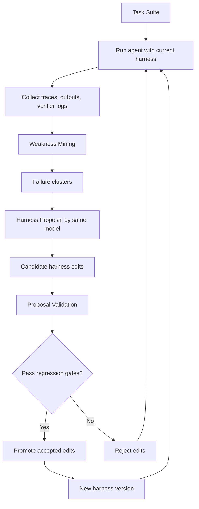
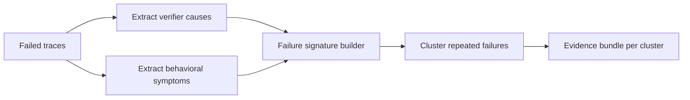
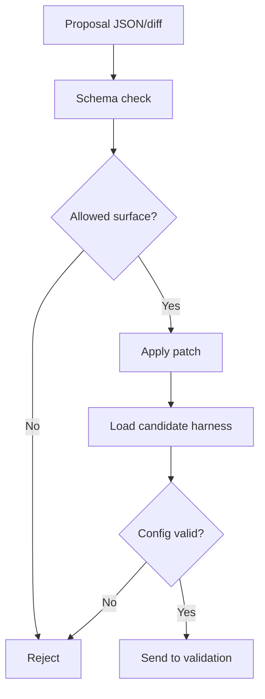
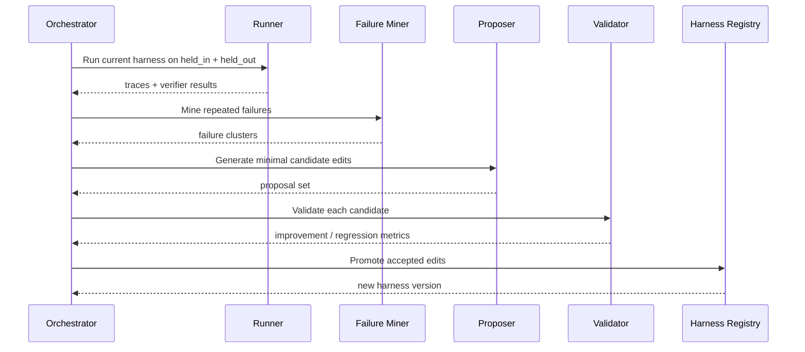
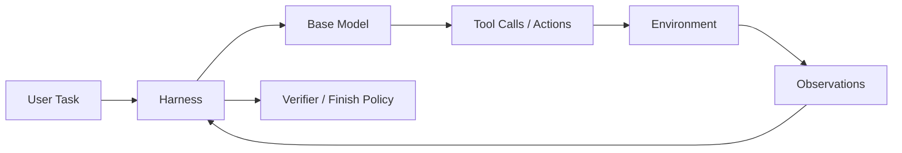
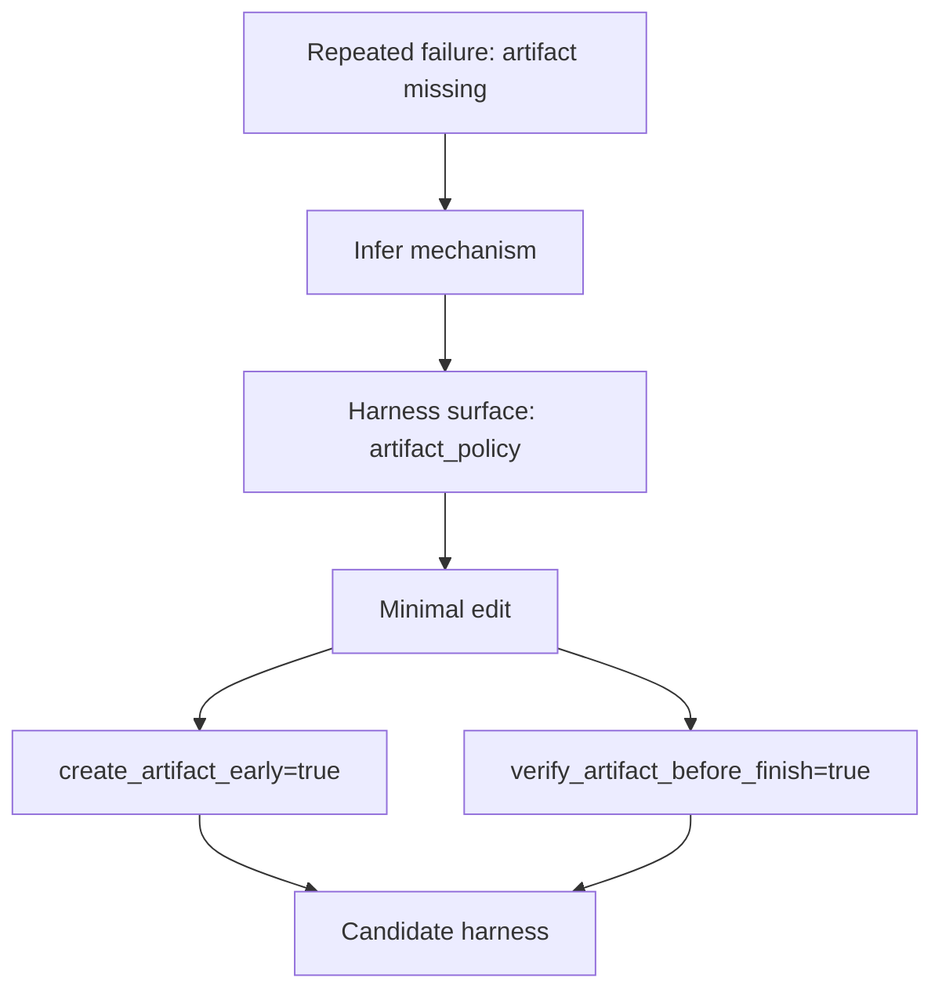
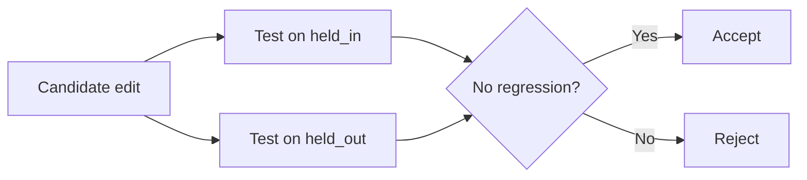

# Xây dựng lại Self-Harness bằng AI terminal code

Tài liệu này viết lại ý tưởng của bài *Self-Harness: Harnesses That Improve Themselves* thành một bản hướng dẫn triển khai thực dụng, để có thể dùng AI terminal coding agent xây dựng lại một pipeline tương tự từ đầu.[1]

## Mục tiêu

Self-Harness xem hiệu năng agent là kết quả của hai phần: **base model** và **harness** điều phối cách model dùng prompt, tools, control flow, recovery policy và verification logic.[1] Điểm cốt lõi của bài báo là thay vì để con người thủ công chỉnh harness, chính agent sẽ dùng execution traces từ các lần chạy trước để phát hiện failure pattern, đề xuất các chỉnh sửa nhỏ, rồi chỉ giữ lại những chỉnh sửa vượt qua regression testing.[1]

## Ý tưởng tổng thể

Pipeline nên được hiểu như một vòng lặp tối ưu harness, không phải một vòng lặp fine-tune model.[1] Model weights giữ nguyên; thứ được sửa là lớp orchestration bao quanh model, như system prompt, policy, retry logic, verifier prompts, state handling, artifact rules và tool-use conventions.[1]



Sơ đồ trên cho thấy vòng lặp 3 giai đoạn được paper mô tả: **Weakness Mining**, **Harness Proposal**, và **Proposal Validation**.[1] Tư duy đúng là: chạy agent, ghi lại bằng chứng, trừu tượng hóa lỗi, sửa đúng bề mặt gây lỗi, kiểm tra hồi quy, rồi mới merge thay đổi.[1]

## Kiến trúc thư mục nên dùng

Để AI terminal coding làm việc ổn định, codebase nên tách rõ phần immutable và editable. Bài báo nhấn mạnh rằng Self-Harness chỉ thay harness chứ không sửa weights của model.[1]

Cấu trúc gợi ý:

```text
self-harness/
├── configs/
│   ├── models/
│   │   └── qwen35.yaml
│   ├── harness/
│   │   ├── base.yaml
│   │   ├── current.yaml
│   │   └── versions/
│   └── benchmarks/
│       ├── held_in.yaml
│       └── held_out.yaml
├── prompts/
│   ├── system.md
│   ├── failure_mining.md
│   ├── proposal.md
│   └── validation.md
├── src/
│   ├── runner.py
│   ├── trace_schema.py
│   ├── failure_miner.py
│   ├── proposer.py
│   ├── patcher.py
│   ├── validator.py
│   ├── promoter.py
│   └── orchestrator.py
├── data/
│   ├── runs/
│   ├── mined_failures/
│   ├── proposals/
│   └── reports/
├── scripts/
│   ├── run_eval.sh
│   ├── run_round.sh
│   └── promote.sh
└── README.md
```

Cách tách này giúp AI agent hiểu chính xác file nào được phép chỉnh: thường chỉ cho sửa `configs/harness`, `prompts/`, hoặc một số policy module trong `src/`.[1] Nếu không khóa phạm vi chỉnh sửa, agent rất dễ “fix benchmark bằng cách phá protocol”, tức vô tình thay benchmark logic thay vì sửa harness thật sự.[1]

## Các bước triển khai

### Bước 1: Chốt benchmark và protocol

Cần có hai split riêng: một split để mining và chọn candidate, một split held-out để chặn overfit khi validate.[1] Paper báo cáo cải thiện trên held-out pass rate, nên nếu chỉ đo trên một tập duy nhất thì sẽ không còn đúng tinh thần Self-Harness nữa.[1]

Checklist:
- Chọn task suite có verifier rõ ràng, ví dụ terminal tasks với pass/fail tự động.[1]
- Tạo `held_in` để khai thác failure và `held_out` để regression test.[1]
- Cố định model, tools, time limit, sandbox, seed policy, artifact policy.
- Lưu toàn bộ metadata của mỗi run để replay được.

### Bước 2: Định nghĩa harness là một object có thể patch

Harness phải được serializable thành YAML hoặc JSON để agent có thể đề xuất patch nhỏ, thay vì viết lại cả hệ thống. Paper nhấn mạnh các chỉnh sửa nên **minimal** và gắn với failure mechanism cụ thể.[1]

Ví dụ các field nên đưa vào harness:

```yaml
system_prompt: prompts/system.md
planning_policy:
  require_plan_for_complex_tasks: true
  max_plan_steps: 8
shell_policy:
  preserve_env_across_commands: true
  timeout_seconds: 120
artifact_policy:
  create_artifact_early: true
  verify_artifact_before_finish: true
retry_policy:
  max_retries_per_tool: 2
  backoff_strategy: linear
error_recovery:
  dependency_precheck: true
  classify_tool_error_before_retry: true
verification_policy:
  run_tests_before_finish: true
  require_exit_code_zero: true
```

Ý chính là agent phải sửa được những thứ như retry policy, tool formatting, shell persistence, artifact discipline hoặc task completion rules, vì đây là các dạng thay đổi mà paper cho thấy có ích cho từng model family khác nhau.[1]

### Bước 3: Xây runner để thu execution traces sạch

Runner là phần quan trọng nhất của bản build thực tế. Nó phải chạy được một task với model + harness hiện tại, rồi ghi lại từng action, observation, tool call, verifier result, runtime error và artifact outcome.[1]

Nên chuẩn hóa trace schema như sau:

```json
{
  "task_id": "tb2_task_001",
  "model": "qwen3.5-35b-a3b",
  "harness_version": "v0.3.1",
  "status": "failed",
  "verifier": {
    "passed": false,
    "failure_cause": "artifact_missing"
  },
  "steps": [
    {
      "t": 1,
      "thought": "...",
      "action_type": "shell",
      "action": "python train.py",
      "observation": "ModuleNotFoundError: xformers"
    }
  ],
  "artifacts": [],
  "stats": {
    "tool_calls": 14,
    "wall_time": 317
  }
}
```

Nếu trace không đủ chi tiết, failure miner sẽ không trích được nguyên nhân ổn định. Paper dựa vào execution traces cộng với verifier evidence để nhận ra điểm yếu mang tính model-specific.[1]

### Bước 4: Làm Weakness Mining

Weakness Mining không chỉ là gom tất cả task fail lại một chỗ. Nó phải rút ra **failure signature** để biết những lần fail nào thực ra cùng một cơ chế lỗi.[1]

Nên tách làm 3 lớp:
- `verifier_cause`: fail vì thiếu artifact, sai schema, test fail, timeout, environment issue.
- `causal_status`: agent không biết làm, biết nhưng không thử, thử sai tool, retry mù, dừng quá sớm.
- `abstract_mechanism`: ví dụ “thiếu dependency precheck”, “mất shell state”, “không verify artifact trước khi finish”.



Đầu ra nên là một `evidence_bundle.json` cho từng cluster, gồm số lượng lỗi, trace đại diện, common symptoms và giả thuyết cơ chế lỗi. Paper mô tả bước này như quá trình nhận diện các failure pattern riêng theo từng model từ execution traces.[1]

### Bước 5: Viết prompt cho Harness Proposal

Ở bước proposal, dùng **chính cùng model** đang được tối ưu để đề xuất chỉnh harness.[1] Prompt phải ép model sinh các sửa đổi nhỏ, có giải thích và có phạm vi rõ ràng, thay vì viết lại cả hệ thống.

Prompt khung nên yêu cầu:
- Mỗi proposal chỉ nhắm vào 1 failure cluster chính.
- Mô tả `target_failure`, `editable_surface`, `proposed_change`, `expected_gain`, `regression_risk`.
- Xuất ra JSON patch hoặc unified diff.
- Không được sửa benchmark, verifier, task data hoặc ground truth.

Ví dụ schema proposal:

```json
{
  "proposal_id": "p_014",
  "target_failure": "artifact_missing_after_successful_work",
  "editable_surface": "artifact_policy",
  "proposed_change": {
    "create_artifact_early": true,
    "verify_artifact_before_finish": true
  },
  "expected_gain": "reduce false-finish without deliverable",
  "risk": "may add one extra verification step"
}
```

Paper nhấn mạnh rằng proposal tốt là proposal **diverse yet minimal**: đa dạng để thử nhiều hướng, nhưng tối thiểu để dễ validate và tránh side effect.[1]

### Bước 6: Áp patch vào candidate harness

Patcher chỉ nên cho phép một số editable surfaces nhất định. Đây là guardrail bắt buộc nếu build bằng AI terminal coding, vì agent rất dễ sửa bừa vào business logic nếu không có sandbox policy.

Một chiến lược an toàn:
- Chỉ cho patch `current.yaml`, `prompts/system.md`, `prompts/validation.md` và `src/policies/*.py`.
- Dùng schema validation sau mỗi patch.
- Tự động reject patch nếu thiếu field, đổi type, hoặc chạm file cấm.



Bước này chuyển proposal lý thuyết thành một candidate harness version cụ thể để đem đi đánh giá. Paper chỉ giữ các ứng viên sau khi đã qua regression testing, nên patch application phải deterministic và có versioning rõ ràng.[1]

### Bước 7: Proposal Validation và regression gates

Mỗi candidate harness cần chạy lại trên cả `held_in` và `held_out`. Paper chỉ accept edit khi regression testing không cho thấy suy giảm và candidate có cải thiện thực sự ở ít nhất một split.[1]

Một gate đơn giản nhưng đúng tinh thần paper:

```python
accept = (
    delta_in >= 0 and
    delta_out >= 0 and
    max(delta_in, delta_out) > 0
)
```

Nên log thêm:
- Pass rate từng split.
- Task IDs mới pass được.
- Task IDs bị regress.
- Thay đổi số tool calls, runtime, cost.

Nếu muốn sản phẩm hóa, nên thêm bootstrap confidence interval hoặc lặp nhiều run cho candidate có cải thiện nhỏ, vì pass rate agent có thể dao động theo môi trường và nondeterminism. Paper mô tả validation như hàng rào để edit chỉ được nhận khi qua regression testing.[1]

### Bước 8: Promote các edit đạt chuẩn

Không phải candidate tốt nào cũng nên merge ngay kiểu “last write wins”. Cần một promoter để:
- Xếp hạng candidate theo improvement và risk.
- Phát hiện patch xung đột cùng sửa một field.
- Merge theo thứ tự hoặc A/B thử thêm.

Ví dụ rule practical:
- Nếu hai patch cùng sửa `retry_policy.max_retries_per_tool`, chỉ chọn patch tốt hơn.
- Nếu một patch tăng pass rate nhưng tăng cost quá mạnh, đánh cờ `needs_review`.
- Sau khi merge, tạo `harness_version = v0.4.0` và lưu diff đầy đủ.

Paper cho thấy kết quả tốt đến từ chuỗi thay đổi cụ thể theo model, không phải một prompt chung cho mọi model.[1] Vì thế cần lưu lịch sử harness theo từng model family riêng, không nên cố hợp nhất hết thành một global harness dùng cho mọi model.[1]

### Bước 9: Lặp vòng tối ưu nhiều round

Một round thường chỉ sửa được một số failure mechanism nổi bật. Giá trị thật xuất hiện khi pipeline lặp qua nhiều round: mỗi round mới khai thác failure còn sót lại của harness đã cải tiến.[1]



Không nên cho vòng lặp chạy vô hạn. Thực tế nên dừng khi không còn edit nào vượt gate, hoặc improvement biên nhỏ hơn một ngưỡng tối thiểu qua 2-3 round liên tiếp.[1]

## Hướng dẫn để giao cho AI terminal coding agent

Đây là phần quan trọng nếu muốn một coding agent thực sự build hộ.

### Prompt tổng quát cho agent

```text
Bạn đang xây một hệ thống Self-Harness tối giản.
Mục tiêu: để cùng một base model tự cải thiện harness của chính nó qua các vòng evaluate -> mine failures -> propose edits -> validate -> promote.

Ràng buộc:
1. Không sửa model weights.
2. Không sửa benchmark data, verifier logic hoặc ground truth.
3. Chỉ được sửa các file trong configs/harness, prompts/, src/policies/.
4. Mọi thay đổi phải versioned, có diff và có thể rollback.
5. Mỗi bước phải tạo artifact JSON để bước sau dùng lại.

Hãy làm tuần tự:
- Tạo skeleton project.
- Định nghĩa trace schema.
- Viết runner.
- Viết failure miner.
- Viết proposer sinh JSON patch.
- Viết validator với held_in / held_out.
- Viết promoter.
- Viết script chạy 1 round hoàn chỉnh.
- Sau mỗi bước, chạy test tối thiểu và ghi kết quả.
```

Prompt này phản ánh đúng tinh thần của paper: tối ưu harness thay vì model, dùng cùng model để đề xuất sửa, và chỉ promote khi qua validation.[1]

### Chiến lược chia việc cho agent

Không nên yêu cầu agent “build full system” trong một lần. Hãy bắt nó làm theo thứ tự sau:
1. Tạo cấu trúc thư mục và file rỗng.
2. Viết Pydantic schema cho trace, proposal, validation result.
3. Viết runner mock với benchmark giả.
4. Viết failure miner trên mock traces.
5. Viết proposer chỉ sinh patch giả lập.
6. Viết validator và promoter.
7. Thay mock LLM bằng model API thật.
8. Kết nối benchmark thật sau cùng.

Cách này giảm nguy cơ agent mắc lỗi kiến trúc lớn ngay từ đầu, đồng thời cho phép test từng lớp độc lập trước khi nối vào environment thật.

## Visualization nguyên lý hoạt động

### 1. Harness không phải model



Điểm cần nhớ là harness đứng giữa task và model, quyết định model được nhắc gì, dùng tool ra sao, khi nào retry, khi nào stop và thế nào là “xong việc”.[1] Self-Harness không đổi node `Base Model`; nó tối ưu node `Harness` dựa trên lỗi quan sát được trong quá trình vận hành.[1]

### 2. Failure thành patch như thế nào



Đây là nguyên lý quan trọng nhất của paper: failure không được xử lý bằng “thêm prompt dài hơn”, mà phải quy được về một cơ chế lỗi và một bề mặt harness có thể sửa trực tiếp.[1] Khi làm đúng, patch sinh ra sẽ cụ thể, executable và có thể regression-test được.[1]

### 3. Tại sao phải có held-out



Nếu không có held-out, hệ thống sẽ học cách vá đúng những lỗi đã thấy chứ không chắc cải thiện agent thật sự. Paper báo cáo held-out pass rate tăng trên ba model family khác nhau, nên đây là phần không được bỏ qua nếu muốn tái hiện kết quả theo đúng nguyên lý.[1]

## MVP nên build trước

Để làm bản đầu tiên trong 1-2 ngày, nên giới hạn phạm vi:
- Một model duy nhất.
- 20-50 task benchmark có verifier.
- 5-10 field harness có thể patch.
- Failure miner đơn giản theo rule-based heuristics trước.
- Proposal LLM xuất JSON, chưa cần diff code phức tạp.
- Validation một round, chưa cần multi-armed search.

MVP này đủ để kiểm tra nguyên lý: agent có tự tìm được điểm yếu lặp lại và có tự sửa harness để tăng pass rate không.[1] Sau khi chứng minh được vòng lặp đó hoạt động, mới mở rộng sang multi-model, richer patch surfaces và adaptive search policy.[1]

## Các lỗi sẽ gặp khi build

### Overfitting harness vào benchmark

Dấu hiệu là pass rate held_in tăng mạnh nhưng held_out không tăng hoặc giảm. Đây chính là lý do paper dùng regression testing trước khi nhận candidate edit.[1]

### Patch quá lớn

Nếu cho model viết lại cả system prompt hoặc cả policy module, bạn sẽ khó biết edit nào thật sự có ích. Paper nhấn mạnh sự cần thiết của các thay đổi **minimal** gắn với từng failure mechanism.[1]

### Failure miner quá mơ hồ

Nếu cluster chỉ có nhãn kiểu “model reasoning yếu” thì proposer không biết sửa gì ở harness. Cần kéo failure về dạng operational như dependency precheck, shell state persistence, artifact verification hoặc retry control.[1]

### Không khóa editable surface

Nếu AI coding agent được sửa verifier hoặc benchmark, nó có thể “thắng giả”. Khi đó pass rate tăng nhưng hệ thống không tốt hơn thật.

## Definition of Done

Hệ thống có thể xem là chạy được khi đạt đủ các điều kiện sau:
- Chạy được 1 round đầy đủ từ evaluate đến promote.
- Sinh trace JSON chuẩn cho mỗi task run.
- Gom được failure clusters có ý nghĩa.
- Sinh được candidate harness patch ở dạng machine-readable.
- Tự validate trên held_in và held_out.
- Chỉ promote patch qua regression gate.
- Lưu version history của harness và diff giữa các phiên bản.

Khi đạt mức này, bạn đã có một bản Self-Harness thực dụng đủ để giao tiếp tục cho AI terminal coding agent tối ưu dần. Bản build không cần giống y hệt implementation nội bộ của tác giả, nhưng vẫn giữ đúng nguyên lý cốt lõi mà bài báo nêu ra.[1]
